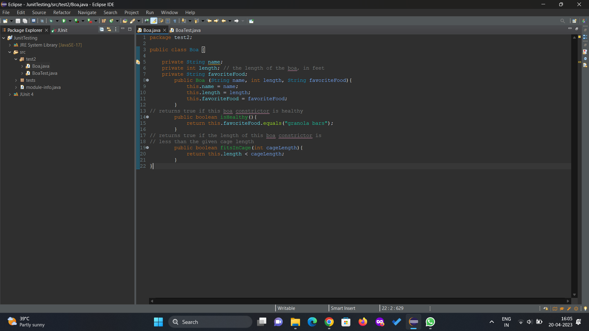
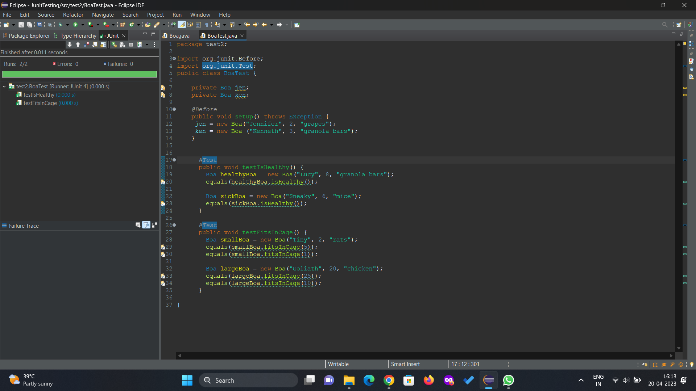
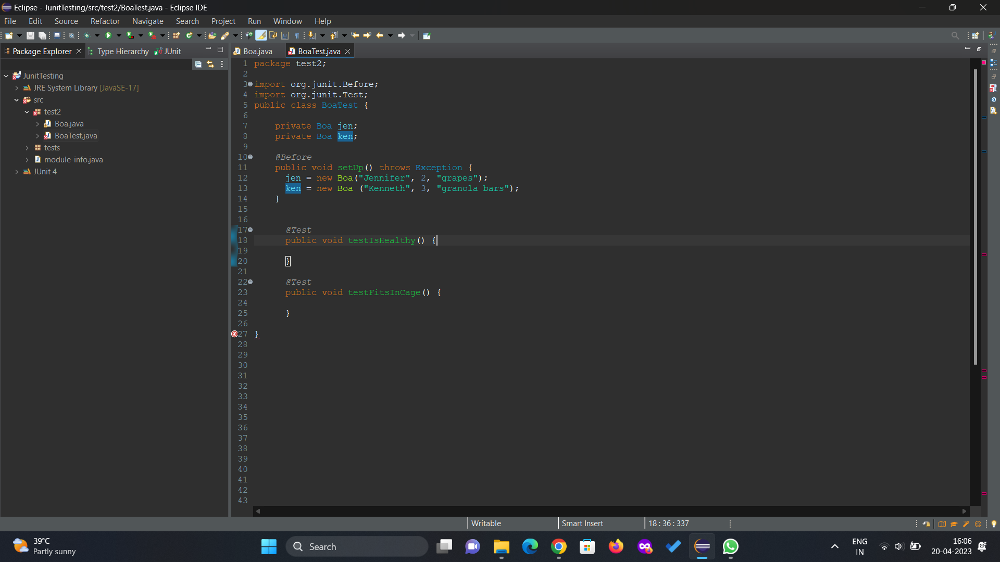
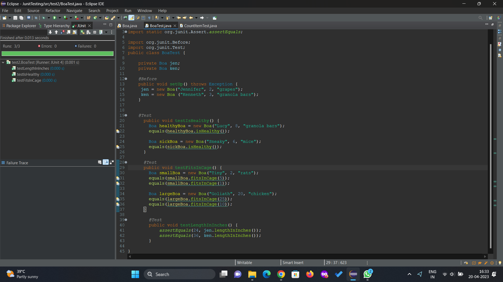

# LAB-8_202001213
# Name - Ketan Khunti
# ID - 202001213

## 1. Creating a new Eclipse project, and within the project create a package and defining the class as mentioned in PDF.


### 2. Class and Test method to test the behaviour of the Boa class : 

## Class
```

public class Boa {
  private String name;
  private int length; // the length of the boa, in feet
  private String favoriteFood;
  
    public Boa (String name, int length, String favoriteFood){
        this.name = name;
        this.length = length;
        this.favoriteFood = favoriteFood;
}

// returns true if this boa constrictor is healthy
    public boolean isHealthy(){
      return this.favoriteFood.equals("granola bars");
}

// returns true if the length of this boa constrictor is
// less than the given cage length
    public boolean fitsInCage(int cageLength){
        return this.length < cageLength;
}

}
```

## TestClass

```
package test;

import static org.junit.Assert.*;
import org.junit.Assert;
import org.junit.Test;
import org.junit.Before;


public class BoaTest {

	@Before
	public void setUp() throws Exception {
	 jen = new Boa("Jennifer", 2, "grapes");
	 ken = new Boa ("Kenneth", 3, "granola bars");
	}

	
	  @Test
	  public void testIsHealthy() {
	    Boa healthyBoa = new Boa("Lucy", 8, "granola bars");
	    Assert.assertTrue(healthyBoa.isHealthy());
	    
	    Boa sickBoa = new Boa("Sneaky", 6, "mice");
	    Assert.assertFalse(sickBoa.isHealthy());
	  }

	  @Test
	  public void testFitsInCage() {
	    Boa smallBoa = new Boa("Tiny", 2, "rats");
	    Assert.assertTrue(smallBoa.fitsInCage(5));
	    Assert.assertFalse(smallBoa.fitsInCage(1));

	    Boa largeBoa = new Boa("Goliath", 20, "chicken");
	    Assert.assertTrue(largeBoa.fitsInCage(25));
	    Assert.assertFalse(largeBoa.fitsInCage(10));
	  }

}

```


### 3. Modified setUp() method in the BoaTest class : 
```
public class BoaTest {
    private Boa jen;
    private Boa ken;
    
    @Before
    public void setUp() throws Exception {
        jen = new Boa("Jennifer", 2, "grapes");
        ken = new Boa("Kenneth", 3, "granola bars");
    }
    
    // write test methods here
}
```



### 4. Modified testIsHealthy() method in the BoaTest class : 
```
         @Test
	  public void testIsHealthy() {
	    Boa healthyBoa = new Boa("Lucy", 8, "granola bars");
	    equals(healthyBoa.isHealthy());
	    
	    Boa sickBoa = new Boa("Sneaky", 6, "mice");
	    equals(sickBoa.isHealthy());
	  }
```
</br>

### 5. Modified testFitsInCage() method in the BoaTest class : 
```
         @Test
	  public void testFitsInCage() {
	    Boa smallBoa = new Boa("Tiny", 2, "rats");
	    equals(smallBoa.fitsInCage(5));
	    equals(smallBoa.fitsInCage(1));

	    Boa largeBoa = new Boa("Goliath", 20, "chicken");
	    equals(largeBoa.fitsInCage(25));
	    equals(largeBoa.fitsInCage(10));
	  }
```
</br>

### 6. Running test cases


### 7. Here's the modified Boa class with the new lengthInInches() method:
```
public class Boa {
    private String name;
    private int length; // the length of the boa, in feet
    private String favoriteFood;

    public Boa(String name, int length, String favoriteFood) {
        this.name = name;
        this.length = length;
        this.favoriteFood = favoriteFood;
    }

    // returns true if this boa constrictor is healthy
    public boolean isHealthy() {
        return this.favoriteFood.equals("granola bars");
    }

    // returns true if the length of this boa constrictor is
    // less than the given cage length
    public boolean fitsInCage(int cageLength) {
        return this.length < cageLength;
    }

    // produces the length of the Boa in inches
    public int lengthInInches() {
        return this.length * 12;
    }
}
```
### Here's an example of a new test case in the BoaTest class that tests the lengthInInches() method:
```
import static org.junit.Assert.assertEquals;
import org.junit.Before;
import org.junit.Test;

public class BoaTest {
    private Boa jen;
    private Boa ken;

    @Before
    public void setUp() throws Exception {
        jen = new Boa("Jennifer", 2, "grapes");
        ken = new Boa("Kenneth", 3, "granola bars");
    }

    @Test
    public void testLengthInInches() {
        assertEquals(24, jen.lengthInInches());
        assertEquals(36, ken.lengthInInches());
    }
}
```


This new test case checks that the lengthInInches() method returns the expected value when called on each of the Boa objects created in the setUp() method. It uses the assertEquals() method to compare the expected value to the actual value returned by the lengthInInches() method. The @Test annotation indicates that this is a test method that should be run by JUnit.
</br>
